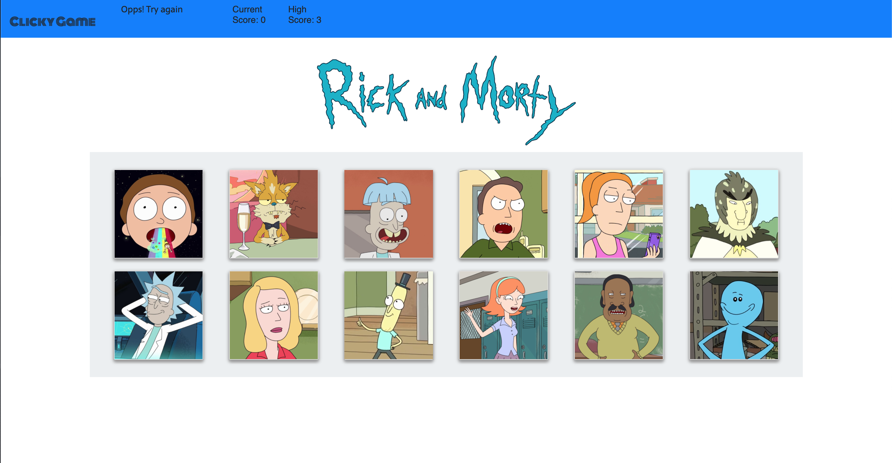

# Clicky Game - Rick and Morty

Rick and Morty Clicky Game is a virtual memory game created with React js

## How to install and run

In order to use the program, you will need to follow this steps: 

            1. git clone https://github.com/alfa9317/clicky-game
            2. cd into the clicky-game
            3. Run npm install to all dependencies
            4. Run npm start
            5. Go to localhost:3000 in your web browser
            
            You will need to have previously installed Node.js

## --------------------👉🏻

## I just want to play!

You can also just go to this url and start playing:
      https://alfa9317.github.io/clicky-game/

Required technologies:
Node.js,
React js,
Visual Studio Code.
